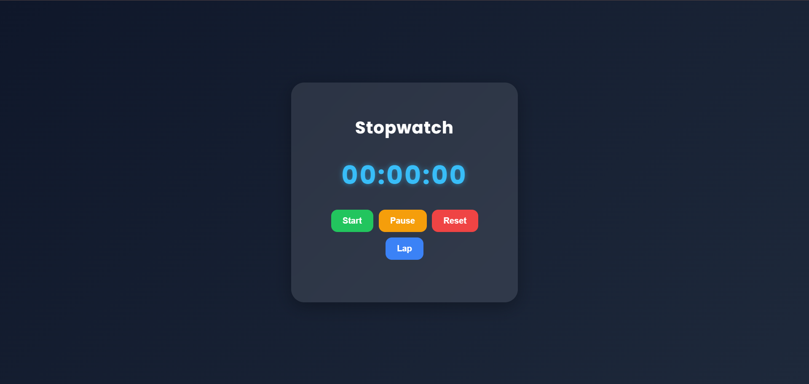
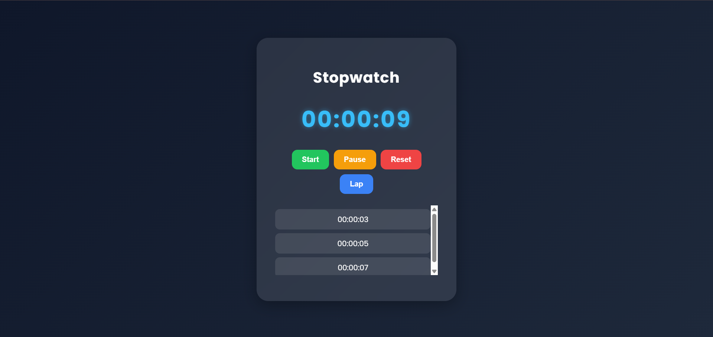

# Stopwatch Web Application

## Project Overview
This project was developed as Task 2 of my Web Development Internship at Prodigy InfoTech. It is a stopwatch web application built using HTML, CSS, and JavaScript. The application accurately measures elapsed time and provides an easy-to-use interface for controlling the stopwatch.

## Features
- Start the stopwatch
- Pause the stopwatch
- Reset the stopwatch
- Record lap times
- Responsive and user-friendly interface

## Technologies Used
- HTML5
- CSS3
- JavaScript

## Project Structure
```
PRODIGY_WD_02/
│── index.html
│── style.css
│── script.js
│── README.md
└── screenshots/
```

## How to Run
1. Download or clone this repository.
2. Open the project folder.
3. Open `index.html` in any web browser.

## Learning Outcomes
- Learned how to use JavaScript timer functions.
- Improved my understanding of DOM manipulation and event handling.
- Gained experience in implementing stopwatch controls and lap functionality.
- Enhanced my skills in building responsive and interactive web applications.
- Improved debugging and problem-solving skills through practical implementation.

  ## Screenshots

### Stopwatch Interface


### Lap Time Recording


## Author
**Pranjali Sonone**
